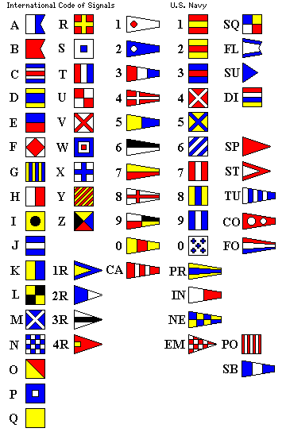

# Flags
### Points: 200

## Category
Cryptography
### AUTHOR: DANNY

## Problem Statement
What do the [flags](flag.png) mean?
## Hints
The flag is in the format PICOCTF{}
## Solution
Upon observing this image, we perceive a series of adorned squares. Upon encountering this, any naval enthusiast would promptly identify the International Code of Signals. These signals constitute a prevalent form of maritime flag signaling cryptography. Merely decipher the signals into their corresponding uppercase characters to obtain the flag.

 

## Flag
`PICOCTF{F1AG5AND5TUFF}`