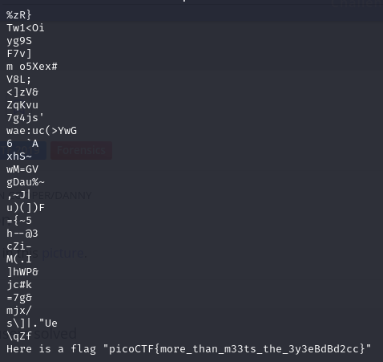

# Glory of the Garden
### AUTHOR: JEDAVIS/DANNY
### Challenge Points: 50

## Category
Forensics

## Challenge Description
This [garden](garden.jpg) contains more than it seems.
## Hints
What is a hex editor?
## Solution
Upon inspecting this file via the shell, it becomes evident that it is a binary file. Merely employing `cat garden.jpg` yields no valuable information. In this scenario, employing `strings garden.jpg` proves beneficial. The `strings` utility locates and displays text strings embedded within a binary file. Upon execution, the flag becomes visible.

 

## Flag
`picoCTF{more_than_m33ts_the_3y3eBdBd2cc}`