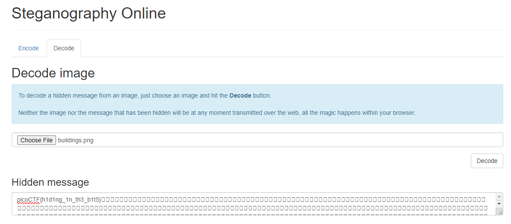

# What Lies Within
### AUTHOR: JULIO/DANNY
### Challenge Points: 150

## Category
Forensics

## Challenge Description
Theres something in the [building](buildings.png). Can you retrieve the flag?
## Hints
There is data encoded somewhere... there might be an online decoder
## Solution
When we notice hidden data within a regular file, our initial suspicion typically turns to steganography. Steganography involves concealing a message within the bits of a file. By employing an online decoder like [stylesuxx's decoder](https://stylesuxx.github.io/steganography/), we can uncover the concealed flag.

 

 

## Flag
`picoCTF{h1d1ng_1n_th3_b1t5}`