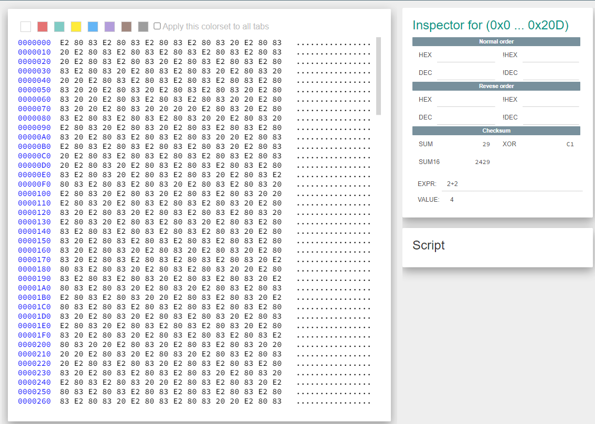

# WhitePages
### AUTHOR: JOHN HAMMOND
### Challenge Points: 250

## Category
Forensics

## Challenge Description
All we observe here are whitespace characters. Nonetheless, it's notable that various types of whitespace characters exist. By examining the file's hexadecimal dump using a hex editor like the one available at [hex-works.com](https://hex-works.com/), we discern the [UTF-8 codes](https://www.utf8-chartable.de/unicode-utf8-table.pl?start=8192&number=128) for both standard spaces (20) and em-spaces (e2 80 83). 

<br>



<br>

These two characters, alternating within the file, suggest a binary pattern. Substituting these characters with 0s and 1s and then converting them into ASCII using a script, such as the one I authored named [whitepgaes.py](whitepages.py), reveals the binary representation of our flag. 
picoCTF{not_all_spaces_are_created_equal_3e2423081df9adab2a9d96afda4cfad6}
```console
root@kali:/Forensics/WhitePages#py whitepages.py
            picoCTF

                    SEE PUBLIC RECORDS & BACKGROUND REPORT
                    5000 Forbes Ave, Pittsburgh, PA 15213
                    picoCTF{not_all_spaces_are_created_equal_3e2423081df9adab2a9d96afda4cfad6}
```

## Flag
`picoCTF{not_all_spaces_are_created_equal_3e2423081df9adab2a9d96afda4cfad6}`