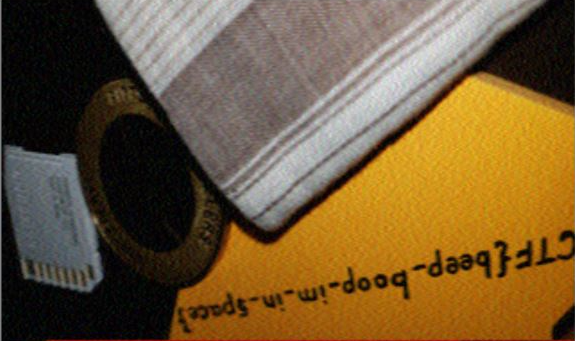

# m00nwalk
### AUTHOR: JOON
### Challenge Points: 250

## Category
Forensics

## Challenge Description
Decode this [message](message.wav) from the moon. You can also find the file in /problems/m00nwalk_3_03dab5f4d1deab675e80ee603fb02236.
## Hints
How did pictures from the moon landing get sent back to Earth?
What is the CMU mascot?, that might help select a RX option
## Solution
In response to the initial clue regarding this problem, images were transmitted via sound waves using a method known as SSTV during the moon landing. We can utilize software such as QSSTV to decode the WAV file into an image.

 

## Flag
`picoCTF{beep-boop-im-in-space}`