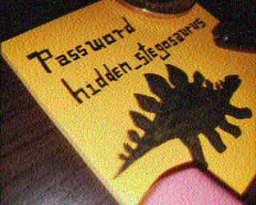

# m00nwalk2
### AUTHOR: JOON
### Challenge Points: 300

## Category
Forensics

## Challenge Description
Revisit the last transmission. We think this [transmission](message.wav) contains a hidden message. There are also some clues [clue 1](clue1.wav), [clue 2](clue2.wav), [clue 3](clue3.wav). 
## Hints
Use the clues to extract the another flag from the .wav file
## Solution
Just like with m00nwalk, we utilize QSSTV or another SSTV decoding software to extract the four images from these four WAV files. This leads us to the [message](message.png) and these three clues:

 

&emsp;

&emsp;

 

Now, for the second part of the challenge: deciphering the flag. This requires some forensic work. The clues lead us to [Alan Eliasen's Future Boy website](https://www.futureboy.us) with the hidden password "hidden_stegosaurus". We visit the site and access the steganographic decoder, using the provided password as the key. Upon uploading our message.wav file, the concealed flag is unveiled.
## Flag
`picoCTF{the_answer_lies_hidden_in_plain_sight}`