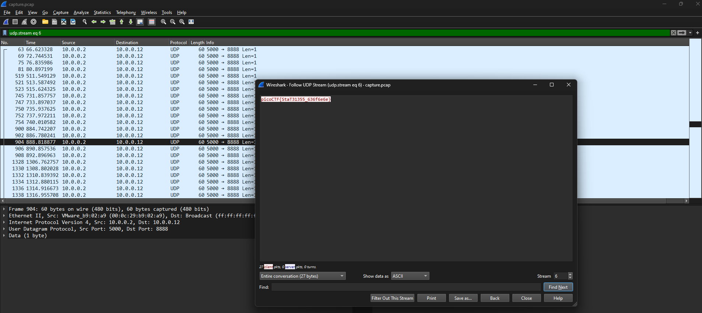

# shark on wire 1
### AUTHOR: DANNY
### Challenge Points: 150

## Category
Forensics

## Challenge Description
We found this [packet capture](capture.pcap). Recover the flag. You can also find the file in /problems/shark-on-wire-1_0_13d709ec13952807e477ba1b5404e620.
## Hints
1. Try using a tool like Wireshark
2. What are streams?
## Solution
The title and clue advise utilizing WireShark, a tool designed for analyzing network data captures. The second clue suggests focusing on the streams. Upon opening the packet capture in WireShark, we commence by filtering the streams. We initiate by filtering for UDP streams, starting with the filter `udp.stream eq 0` entered into the display filter bar, or by using Ctrl+/ on Windows. Subsequently, we examine this stream by navigating to Analyze > Follow > UDP Stream or using the shortcut Ctrl+Alt+Shift+U on Windows. Initially, this reveals some arbitrary data, prompting us to proceed to the next filter, `udp.stream eq 1`. Eventually, at `udp.stream eq 6`, we unearth our flag.

 

 

## Flag
`picoCTF{StaT31355_636f6e6e}`