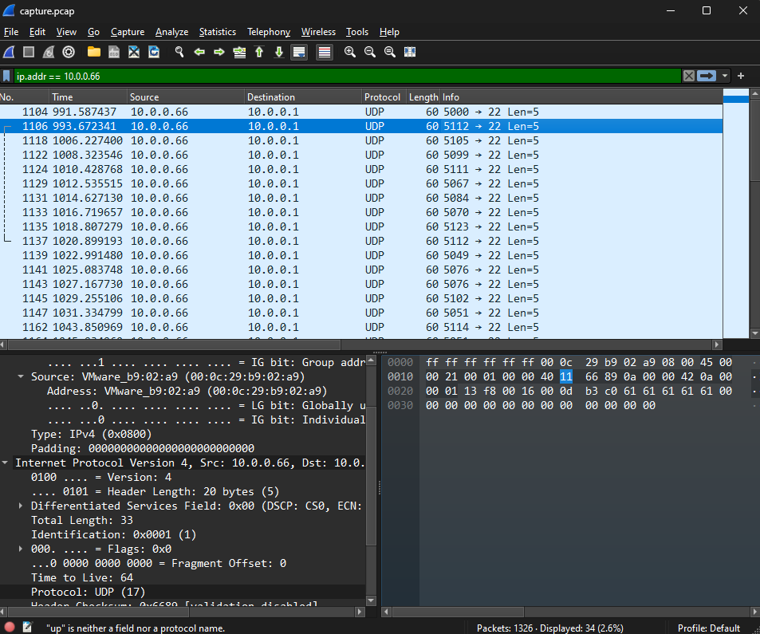

# shark on wire 2
### AUTHOR: DANNY
### Challenge Points: 300

## Category
Forensics

## Challenge Description
We found this [packet capture](capture.pcap). Recover the flag that was pilfered from the network.

## Hints
(None)

## Solution
This proved to be one of the more challenging tasks within the Forensics category. While WireShark remained the sole tool required, following the streams for the flag proved futile, as numerous false flags were intentionally scattered to deceive participants. However, by filtering using Ctrl+F on Windows or Cmd+F on Linux/MacOS and searching for the strings "start" and "end" within the packet bytes, a packet with the data "start" followed by another with "end" was located. This discovery was made by meticulously inspecting the packet bytes until a notable pattern emerged. The initial packet bore an IP address of 10.0.0.66, and subsequent packets shared this same address, leading to the "end" packet. Encouraged by this find, further filtering for packets originating from this address was conducted. By navigating to the display filter bar or using the shortcut Ctrl+/ on Windows and filtering for `ip.addr == 10.0.0.66`, the packet count was significantly reduced. Subsequently, additional insights into the transmission of these packets were gained by checking View > Name Resolution > Resolve Transport Address. It was then observed that each packet info contained a four-digit number, with the first digit being 5. By extracting the last three digits of each number in chronological order and converting them to ASCII, the flag was successfully obtained.

<br>



<br>

The 3 numbers behind are decimal numbers, we can decode decimal to ascii using the [script](script.py) I have created below.

```console
root@kali:/Forensics/WhitePages# py script.py
picoCTF{p1LLf3r3d_data_v1a_st3g0}
```

## Flag
`picoCTF{p1LLf3r3d_data_v1a_st3g0}`