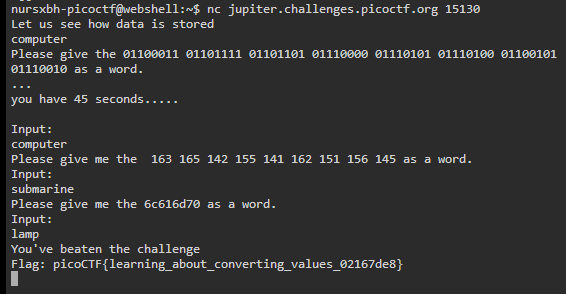

# Based
### AUTHOR: ALEX FULTON/DANIEL TUNITIS
### Challenge Points: 200

## Category
General Skills

## Challenge Description
To get truly 1337, you must understand different data encodings, such as hexadecimal or binary. Can you get the flag from this program to prove you are on the way to becoming 1337? Connect with `nc jupiter.challenges.picoctf.org 15130`.
## Hints
1. I hear python can convert things.
2. It might help to have multiple windows open
## Solution
After connecting to the port, we encounter a series of questions asking us to convert numbers into words. Through several attempts, we realize that the numbers are in various bases, and converting them to ASCII yields the words. The questions are timed and randomized, so we must adhere to their time constraints. We can utilize an online resource or create a script (like [Based.py](Based.py)). Ultimately, the first conversion is from binary to ASCII, the second from octal to ASCII, and the third from hexadecimal to ASCII. By answering these questions correctly and within the allotted time, we receive the flag.

 

 

## Flag
`picoCTF{learning_about_converting_values_02167de8}`