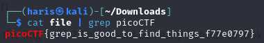

# First Grep
### AUTHOR: ALEX FULTON/DANNY TUNITIS
### Challenge Points: 100

## Category
General Skills

## Challenge Description
Can you find the flag in [file](file)? This would be really tedious to look through manually, something tells me there is a better way.
## Hints
grep [tutorial](https://ryanstutorials.net/linuxtutorial/grep.php)
## Solution
When we use the `cat` command to display the contents of this file in the shell to find the flag, we encounter a lot of random characters. In this case, we can employ the `grep` command, which filters for a specific expression in plain text. Since picoCTF flags are always in the format of picoCTF{...}, we can grep for the expression `picoCTF`. The command would be `cat file | grep picoCTF`.

 

 

## Flag
`picoCTF{grep_is_good_to_find_things_f7730797}`