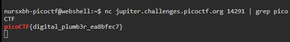

# plumbing
### AUTHOR: ALEX FULTON/DANNY TUNITIS
### Challenge Points: 200

## Category
General Skills

## Challenge Description
Sometimes you need to handle process data outside of a file. Can you find a way to keep the output from this program and search for the flag? Connect to `jupiter.challenges.picoctf.org 14291`.
## Hints
1. Remember the flag format is picoCTF{XXXX}
2. What's a pipe? No not that kind of pipe... This [kind](http://www.linfo.org/pipes.html)
## Solution
Upon connecting to this port, we receive numerous lines of filler messages. Here, we can utilize a pipe `|`. A pipe in shell allows us to combine two commands into one. Therefore, if we wish to grep the output of the netcat host connection for a flag, we can use the command `nc jupiter.challenges.picoctf.org 14291 | grep picoCTF`.

 

 

## Flag
`picoCTF{digital_plumb3r_ea8bfec7}`