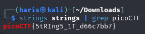

# strings it
### AUTHOR: SANJAY C/DANNY TUNITIS
### Challenge Points: 100

## Category
General Skills

## Challenge Description
Can you find the flag in [file](strings) without running it? 
## Hints
[strings](https://linux.die.net/man/1/strings)
## Solution
The title and hint in the tutorial suggest using the `strings` command, such as `strings strings`, to find the flag. However, this yields a large amount of plain text that would be cumbersome to manually sift through. Instead, we can utilize the `grep` command, which filters specific expressions in plain text. Since we know that picoCTF flags are in the format picoCTF{...}, we can grep for "picoCTF." The command would then be `strings strings | grep picoCTF`.

 

 

## Flag
`picoCTF{5tRIng5_1T_d66c7bb7}`