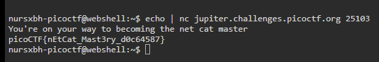

# what's a net cat?
### AUTHOR: SANJAY C/DANNY TUNITIS
### Challenge Points: 100

## Category
General Skills

## Challenge Description
Using netcat (nc) is going to be pretty important. Can you connect to `jupiter.challenges.picoctf.org` at port `25103` to get the flag?
## Hints
nc [tutorial](https://linux.die.net/man/1/nc)
## Solution
Since the problem statement provides us with the host and port, we can interact with it directly. To do this, we can simply echo the message received when connecting to it using `echo | nc jupiter.challenges.picoctf.org 25103`.

 

 

## Flag
`picoCTF{nEtCat_Mast3ry_d0c64587}`