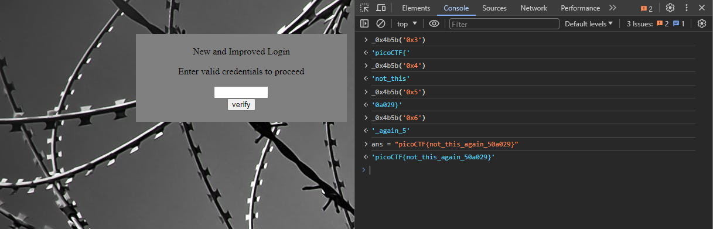

# Client-side-again
### AUTHOR: DANNY
### Challenge Points: 200

## Category
Web Exploitation

## Challenge Description
Can you break into this super secure portal? `https://jupiter.challenges.picoctf.org/problem/6353/` ([link](https://jupiter.challenges.picoctf.org/problem/6353/)) or https://jupiter.challenges.picoctf.org/problem/6353/
## Hints
What is obfuscation?
## Solution
After opening the link, we encounter another login page. When we inspect the page source, we find a complex JavaScript code that has been obfuscated. This indicates that the code has been compressed and formatted in a way that makes it hard to understand. We can make it more readable by using an online tool like this [Online JavaScript Beautifier](https://beautifier.io/). Once the code is deobfuscated, we are presented with the following:
```js
var _0x5a46 = ['0a029}', '_again_5', 'this', 'Password\x20Verified', 'Incorrect\x20password', 'getElementById', 'value', 'substring', 'picoCTF{', 'not_this'];
(function(_0x4bd822, _0x2bd6f7) {
    var _0xb4bdb3 = function(_0x1d68f6) {
        while (--_0x1d68f6) {
            _0x4bd822['push'](_0x4bd822['shift']());
        }
    };
    _0xb4bdb3(++_0x2bd6f7);
}(_0x5a46, 0x1b3));
var _0x4b5b = function(_0x2d8f05, _0x4b81bb) {
    _0x2d8f05 = _0x2d8f05 - 0x0;
    var _0x4d74cb = _0x5a46[_0x2d8f05];
    return _0x4d74cb;
};

function verify() {
    checkpass = document[_0x4b5b('0x0')]('pass')[_0x4b5b('0x1')];
    split = 0x4;
    if (checkpass[_0x4b5b('0x2')](0x0, split * 0x2) == _0x4b5b('0x3')) {
        if (checkpass[_0x4b5b('0x2')](0x7, 0x9) == '{n') {
            if (checkpass[_0x4b5b('0x2')](split * 0x2, split * 0x2 * 0x2) == _0x4b5b('0x4')) {
                if (checkpass[_0x4b5b('0x2')](0x3, 0x6) == 'oCT') {
                    if (checkpass[_0x4b5b('0x2')](split * 0x3 * 0x2, split * 0x4 * 0x2) == _0x4b5b('0x5')) {
                        if (checkpass['substring'](0x6, 0xb) == 'F{not') {
                            if (checkpass[_0x4b5b('0x2')](split * 0x2 * 0x2, split * 0x3 * 0x2) == _0x4b5b('0x6')) {
                                if (checkpass[_0x4b5b('0x2')](0xc, 0x10) == _0x4b5b('0x7')) {
                                    alert(_0x4b5b('0x8'));
                                }
                            }
                        }
                    }
                }
            }
        }
    } else {
        alert(_0x4b5b('0x9'));
    }
}
```
It appears that the code's logic has been obfuscated, as there are many functions, variables, and conditions in the script. One way to address this is by recreating these variables in a JavaScript console and examining each part of the if statement in the verify function.

<br>


## Flag
`picoCTF{not_this_again_50a029}`