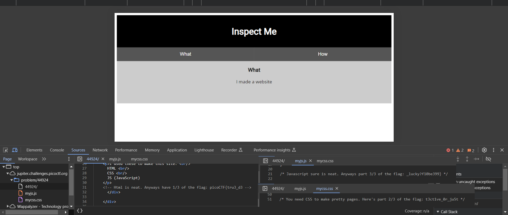

# Insp3ct0r
### AUTHOR: ZARATEC/DANNY
### Challenge Points: 50

## Category
Web Exploitation

## Challenge Description
Kishor Balan tipped us off that the following code may need inspection: `https://jupiter.challenges.picoctf.org/problem/44924/` ([link](https://jupiter.challenges.picoctf.org/problem/44924/)) or http://jupiter.challenges.picoctf.org:44924
## Hints
1. How do you inspect web code on a browser?
2. There's 3 parts
## Solution
In this scenario, we encounter a website with minimal content. The problem statement hints at "inspecting" the site. By utilizing a browser's developer tools, such as Chrome's Inspect Element option (accessible via right-click or Ctrl+Shift+C on Windows, Cmd+Shift+C on Linux/MacOS), we can examine the site's source code. Navigating to the Source tab reveals the index.html, mycss.css, and myjs.js files, each containing a fragment of the flag.

 

 

## Flag
`picoCTF{tru3_d3t3ct1ve_0r_ju5t_lucky?f10be399}`