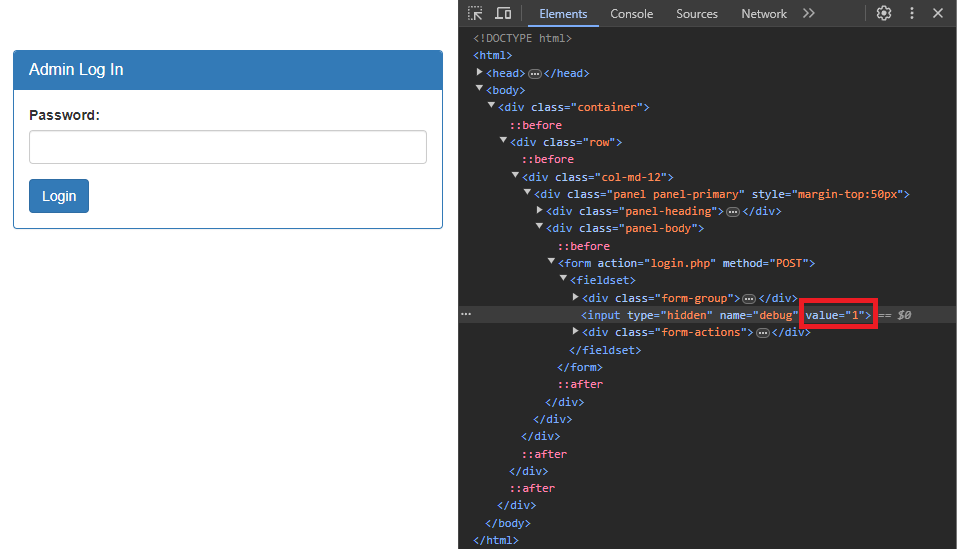

# Irish-Name-Repo 3
### AUTHOR: XINGYANG PAN
### Challenge Points: 400

## Category
Web Exploitation

## Challenge Description
There is a secure website running at `https://jupiter.challenges.picoctf.org/problem/40742/` ([link](https://jupiter.challenges.picoctf.org/problem/40742/)) or https://jupiter.challenges.picoctf.org/problem/40742/. Try to see if you can login as admin!
## Hints
Seems like the password is encrypted.
## Solution
Once again, we find ourselves on a page that appears similar to those in Irish-Name-Repo 1 and 2. However, this time, when we attempt a SQL Injection such as `' or 1=1--`, we encounter a server-side HTTP error 500. Additionally, we observe that there is now only a password input field, seemingly preventing any further exploration. Yet, upon inspecting the page's elements, we discover that there are multiple inputs, with one of them hidden and set to 0. By changing this hidden input to 1, we can reveal the query after it has been encrypted, which previously hindered our injection attempts.

<br>



<br>

When we use the same injection `' or 1=1--`, this time we receive the encrypted query:
```
password: ' or 1=1--
SQL query: SELECT * FROM admin where password = '' be 1=1--'
```
We see that the alphabetical characters 'o' and 'r' have been swapped to a 'b' and 'e'. Curious. Let's try putting every letter in the alphabet after the comment to see exactly what type of encryption this is while setting the hidden input to 1 still.
```
password: ' or 1=1--abcdefghijklmnopqrstuvwxyz
SQL query: SELECT * FROM admin where password = '' be 1=1--nopqrstuvwxyzabcdefghijklm'
```
We can now verify that this is a form of Caesar cipher. The characters for the word `OR` are replaced with `BE`. Reattempting our query, this time following the encryption, looks like this: `' be 1=1--`. The portal grants us access, and we are able to retrieve the flag.
## Flag
`picoCTF{3v3n_m0r3_SQL_4424e7af}`