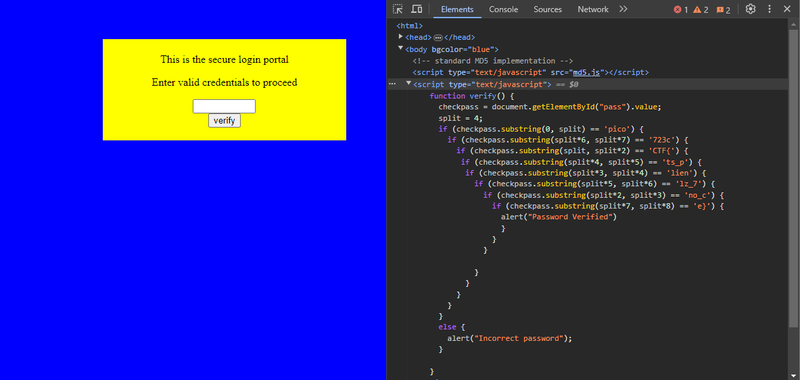

# dont-use-client-side
### AUTHOR: ALEX FULTON/DANNY
### Challenge Points: 100

## Category
Web Exploitation

## Challenge Description
Can you break into this super secure portal? `https://jupiter.challenges.picoctf.org/problem/29835/` ([link](https://jupiter.challenges.picoctf.org/problem/29835/)) or https://jupiter.challenges.picoctf.org/problem/29835/
## Hints
Never trust the client
## Solution
In this scenario, we encounter a basic login portal. The title and hint playfully caution against storing passwords on the client side of websites. By using inspect element or viewing the page source, we can observe a script in the site's HTML that divides the password into substrings. By matching these substrings with the provided indices, we can reconstruct the password, which is the flag.

 

## Flag
`picoCTF{no_clients_plz_7723ce}`