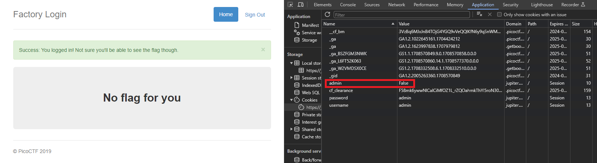

# logon
### AUTHOR: BOBSON
### Challenge Points: 100

## Category
Web Exploitation

## Challenge Description
The factory is hiding things from all of its users. Can you login as logon and find what they've been looking at? `https://jupiter.challenges.picoctf.org/problem/15796/` ([link](https://jupiter.challenges.picoctf.org/problem/15796/)) or https://jupiter.challenges.picoctf.org/problem/15796/
## Hints
Hmm it doesn't seem to check anyone's password, except for {{name}}'s?
## Solution
We encounter a more difficult portal that doesn't store any sensitive information on the client side. Nevertheless, we can still bypass it by manipulating the cookies. By inspecting the elements and navigating to the Application tab, we observe that the site sets three cookies upon login: one for the username, one for the password, and one for the admin status (a boolean value). By changing the admin cookie from False to True, we trick the server into believing that we are an admin, allowing us to log in to the site.

 

 

## Flag
`picoCTF{th3_c0nsp1r4cy_l1v3s_6edb3f5f}`