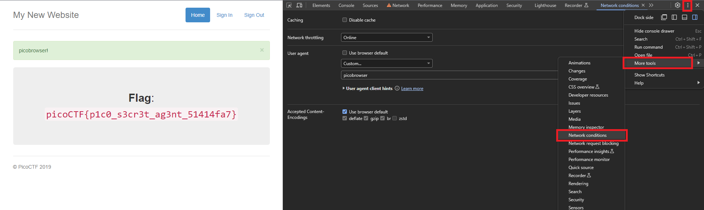

# picobrowser
### AUTHOR: ARCHIT
### Challenge Points: 200

## Category
Web Exploitation

## Challenge Description
This website can be rendered only by **picobrowser**, go and catch the flag! `https://jupiter.challenges.picoctf.org/problem/50522/` ([link](https://jupiter.challenges.picoctf.org/problem/50522/)) or https://jupiter.challenges.picoctf.org/problem/50522/
## Hints
You dont need to download a new web browser
## Solution
Here, we encounter a site that verifies the browser before granting access. Since **picobrowser** is not a legitimate browser name, it blocks access. To bypass this restriction, we need to modify the browser's User-Agent string. In Chrome, you can do this by opening the developer tools, navigating to the Network conditions tab, and selecting "Edit" under User agent. Changing the User-Agent to **picobrowser** allows you to access the site and view the flag.

 

 

## Flag
`picoCTF{p1c0_s3cr3t_ag3nt_51414fa7}`